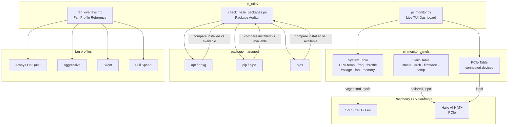

```mermaid
graph TD
    subgraph pi_utils["pi_utils/"]
        MON["pi_monitor.py\nLive TUI Dashboard"]
        CHK["check_hailo_packages.py\nPackage Auditor"]
        FAN["fan_overlays.md\nFan Profile Reference"]
    end

    subgraph MON_tables["pi_monitor panels"]
        SYS["System Table\nCPU temp · freq · throttle\nvoltage · fan · memory"]
        HAI["Hailo Table\nstatus · arch · firmware · temp"]
        PCI["PCIe Table\nconnected devices"]
    end

    subgraph PKG_sources["package managers"]
        APT["apt / dpkg"]
        PIP["pip / pip3"]
        PIPX["pipx"]
    end

    subgraph FAN_profiles["fan profiles"]
        FP1["Always On Quiet"]
        FP2["Aggressive"]
        FP3["Silent"]
        FP4["Full Speed"]
    end

    subgraph HW["Raspberry Pi 5 Hardware"]
        SOC["SoC · CPU · Fan"]
        HAILO["Hailo AI HAT+\nPCIe"]
    end

    MON --> SYS
    MON --> HAI
    MON --> PCI

    CHK --> APT
    CHK --> PIP
    CHK --> PIPX

    FAN --> FP1 & FP2 & FP3 & FP4

    SYS -->|vcgencmd, sysfs| SOC
    HAI -->|hailortcli, lspci| HAILO
    PCI -->|lspci| HAILO

    APT & PIP & PIPX -->|compare installed vs available| CHK
```
